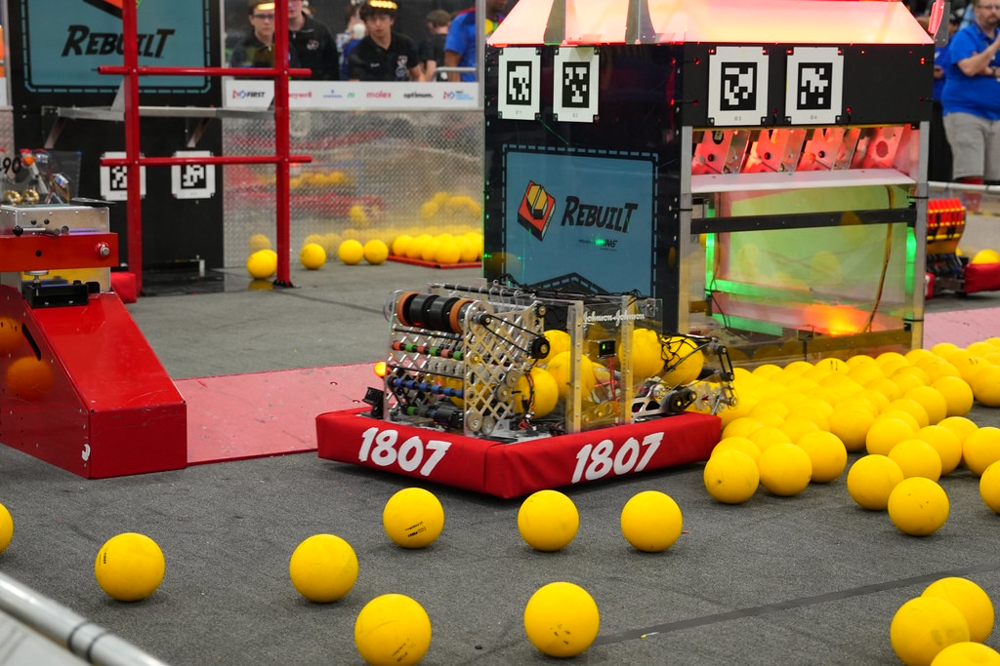

# RA | Team 1807 Redbird Robotics | 2026 REBUILT

Robot code for RA, our 2026 FRC robot. Java, WPILib command-based, CTRE Phoenix 6.

## What it does
- Swerve drive (Phoenix 6 swerve, generated `TunerConstants`)
- Ground collector with a pivot and roller
- Indexer + kicker feeding a static double shooter
- Auto-aim at the hub using pose, with alliance aware feeding targets
- 4 Limelights fused into the pose estimate (MegaTag1 with our own filtering)
- Blinkin LEDs for driver feedback
- Capable of On the Fly path making before games

## Setup
1. Install WPILib 2026 and clone the repo
2. `./gradlew build`
3. Deploy with `./gradlew deploy` or the WPILib "Deploy Robot Code" button
4. Vendordeps: PathplannerLib, Phoenix 6, Revlib, WPILib commands

## Controls
**Driver (port 0)**
- Left stick / right stick: Drive / rotate (field-centric)
- Left bumper: Slow mode
- Right trigger: Auto-aim at hub
- X : Brake (X-lock) 
- Back (2 rectangles): Re-seed field-centric heading (Reset Gyro)

**Operator (port 1)**

- A / X: Collector rollers forward / reverse
- Left / right bumper: Pivot to stowed / deployed
- Right trigger: Shoot (auto hood + flywheel from distance)
- Left trigger: Feeding shot (max flywheel, feeding hood angle)
- B: Flywheel only
- Y: Spin indexer
- Start / Back: Hood angle +/- increment

## Key concepts

- **Vision:** each Limelight estimate is rejected unless tag count, distance, and ambiguity pass checks, then added with per-camera stdevs.
- **Shooting:** flywheel speed and hood angle come from `InterpolatingTreeMap`s keyed on distance to hub. Tune the tables in `FlywheelSubsys` / `HoodSubsys`.

## Credits

- **Programming Team:**  Zarif Ahmed, Alexander Morgan, Diya Parikh, Colin Granaghan, Leah Gaddy and Anthony Adegbege

- **Thank you to our mentors and alumni:** Written with the support and encouragement of our wonderful mentors and alumni: Jim Kaba, Joey Forte, Evan Kaba, Gavin Elwell, Evangaline Huey, T.J. Vosseler, Dr. Becky, Erin Vosseler, and Don Elwell.
